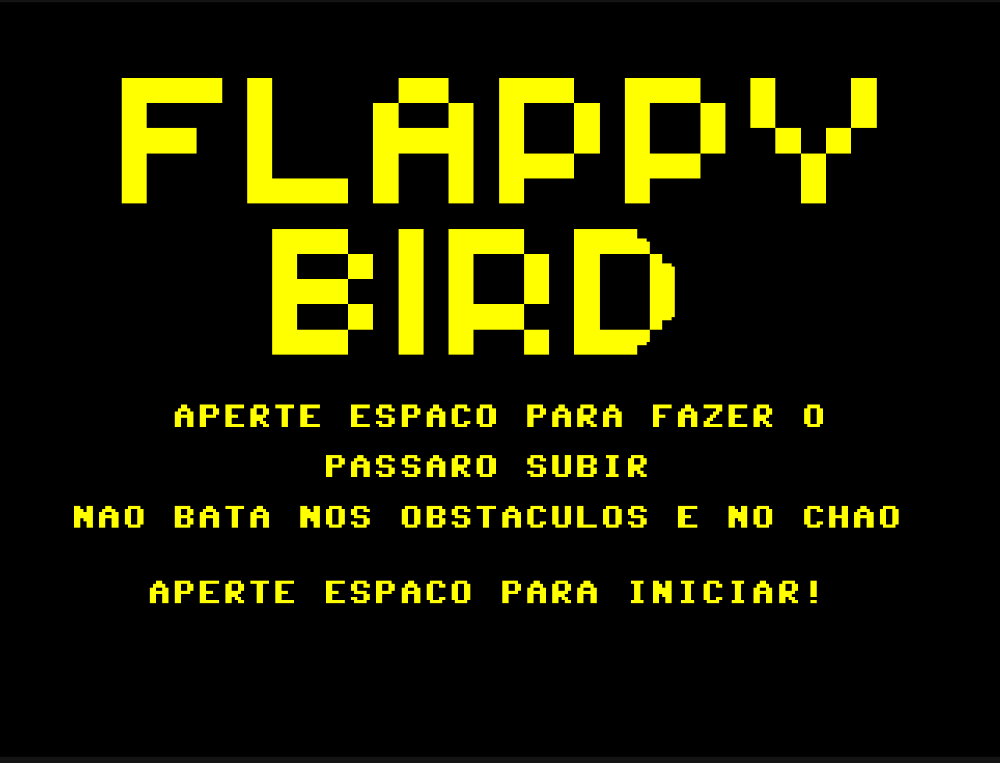
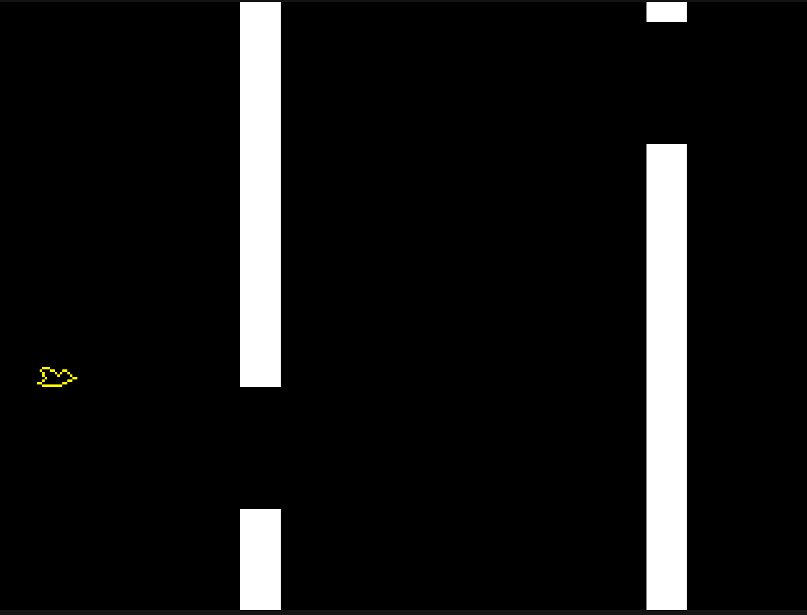
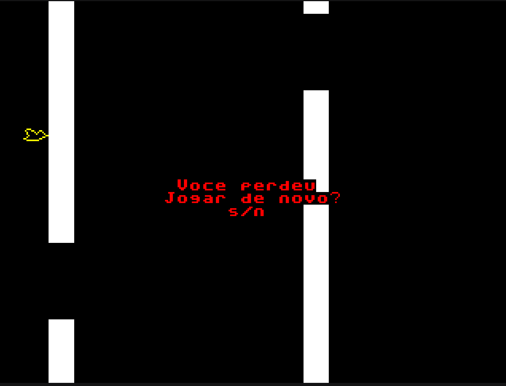
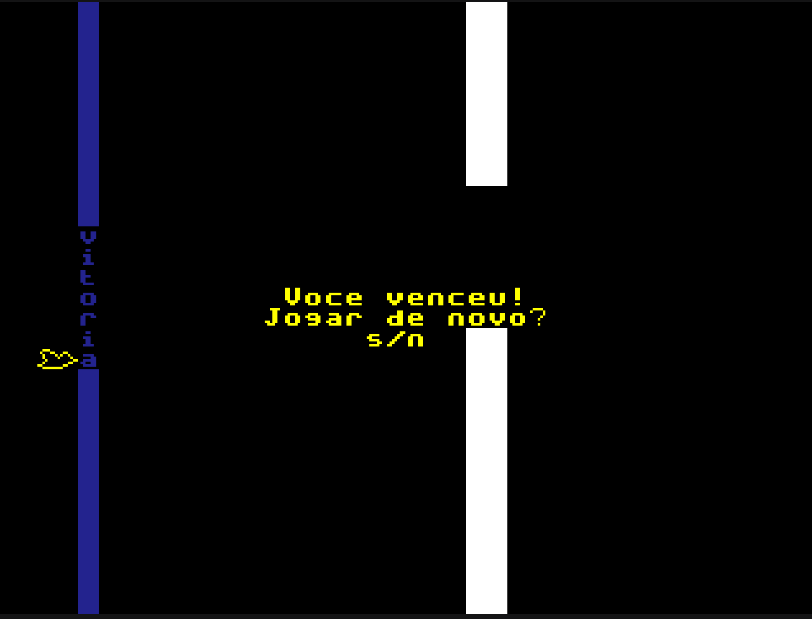

<h1 align = "center">Prática em Organização de Computadores</h1>
Nesta disciplina ministrada pelo professor Eduardo do Valle Simões, foi implementada em VHDL a máquina de controle do processador desenvolvido pelo professor, e foi desenvolvido um jogo com o assembly do processador.
<h2 align = "center">O Processador </h2>
A pasta DE0_CV contém o projeto do processador. Dentro dela, o arquivo cpu.vhd contém a implementação do processador em VHDL. A parte da máquina de controle foi desenvolvida durante as aulas, seguindo as instruções do professor.
<h2 align = "center">O jogo</h2>
O jogo desenvolvido foi uma versão do famoso jogo Flappy Bird.
O objetivo é passar pelos obstáculos sem tocá-los e sem tocar o chão. Para manter o passarinho voando, deve-se pressionar a tecla de espaço.
 
Vídeo apresentando o jogo: https://youtu.be/XVGeayRP1BM

<h4>Screenshots do jogo</h4>

>Tela inicial

  

>Jogando

  

>Tela de derrota

  

>Tela de vitória

  

